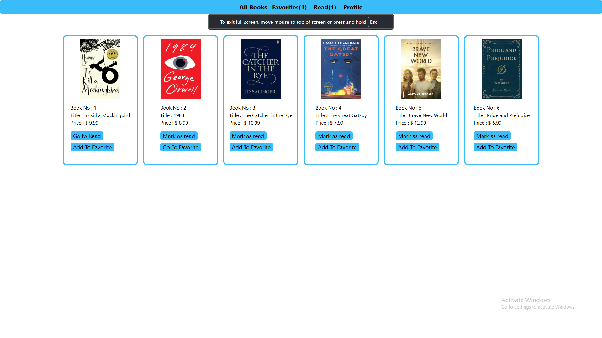
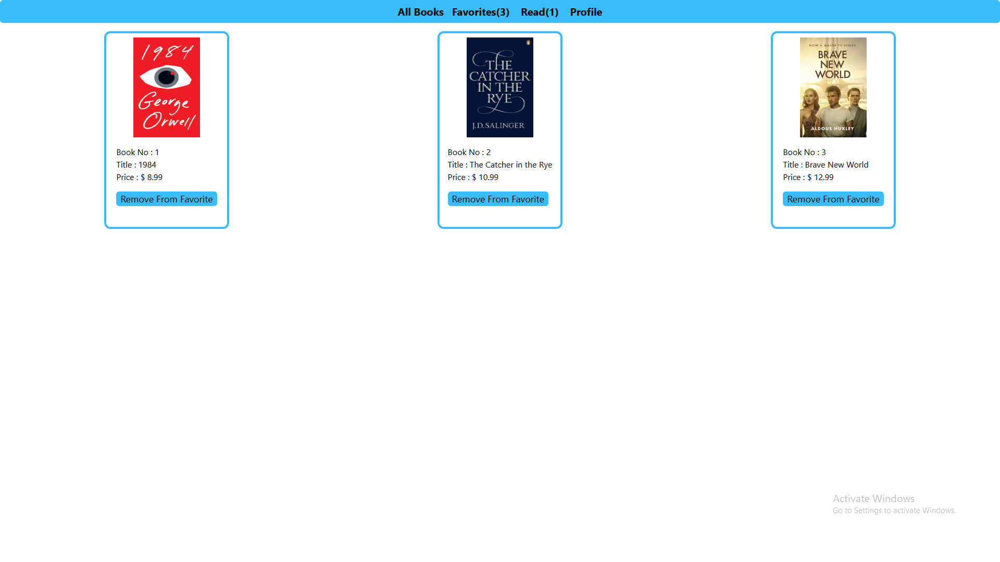
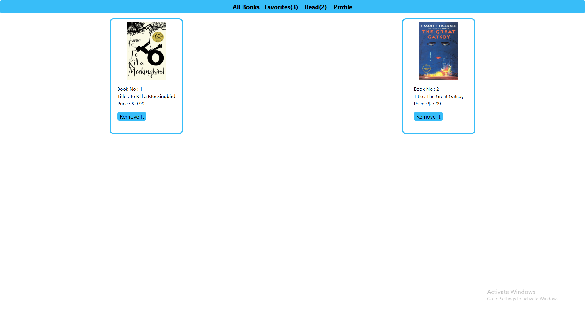
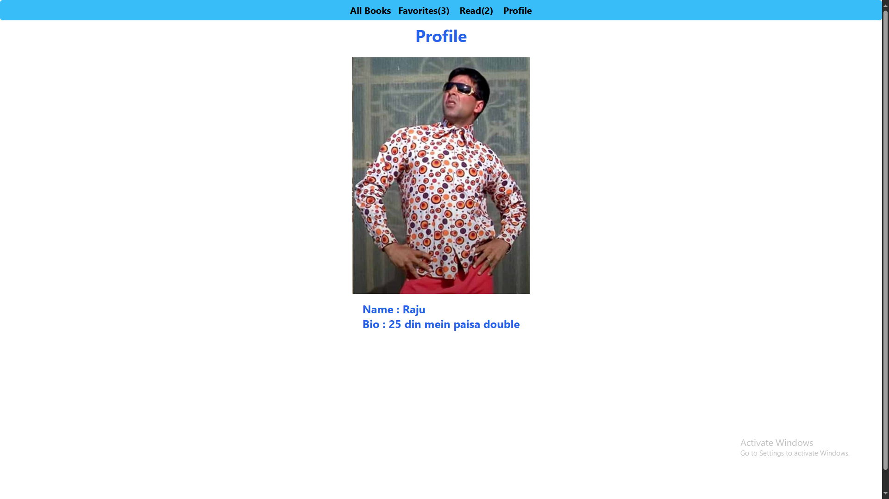

# Book App

### **to run the app enter the command :- npm install then npm init and the last npm run dev**

## Main Page 

#### All Book Data will Fetch On this Page 

[]

## Favorite Book Page 

[]

## Read Book Page 

[]

## Profile Page 

[]